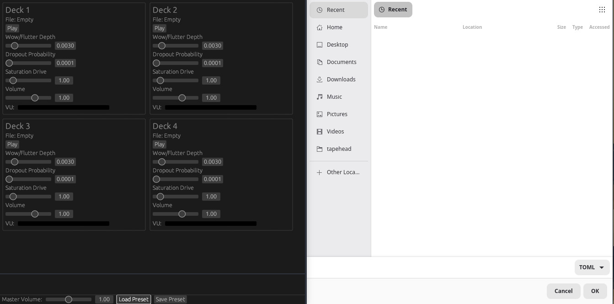

Tapehead is envisioned as audio processing application that emulates the quirks of analog cassette decks, things like wow and flutter, while providing a interface with four virtual decks.

Users drop in audio files, manipulate them live via a GUI, and record outputs as new stems or files. The goal is a tool that’s intuitive for musicians and sound designers, blending nostalgic emulation with modern usability. It’s not a full DAW plugin but a standalone app for quick dub-style experiments, lo-fi effects, and tape-echo chains.

---

## Features

- **Four Virtual Decks** — Load and manipulate up to four audio files simultaneously
- **Analog Tape Emulation** — Realistic wow, flutter, and tape saturation modeling
- **Live GUI Control** — Real-time parameter manipulation during playback
- **Stem & File Export** — Record outputs directly as new stems or audio files
- **Tape Echo Chains** — Build lo-fi delay and echo effects inspired by classic dub production

## Use Cases

- Lo-fi music production and sound design
- Dub-style mixing and experimentation
- Tape degradation and texture effects
- Quick audio mangling without a full DAW

## Roadmap

- [ ] Core tape emulation engine (wow & flutter)
- [ ] Four-deck GUI
- [ ] Real-time parameter control
- [ ] Audio file import (drag & drop)
- [ ] Stem/file export
- [ ] Tape echo chain effects

